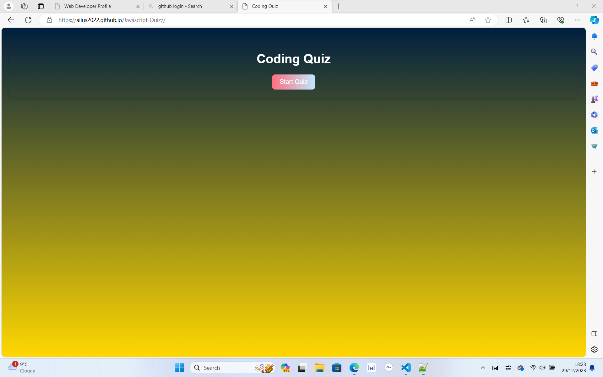
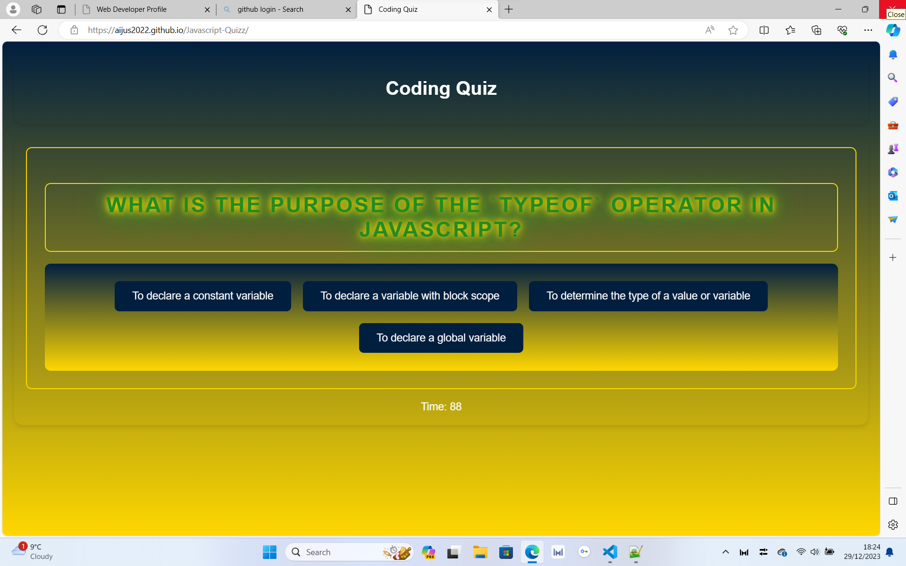
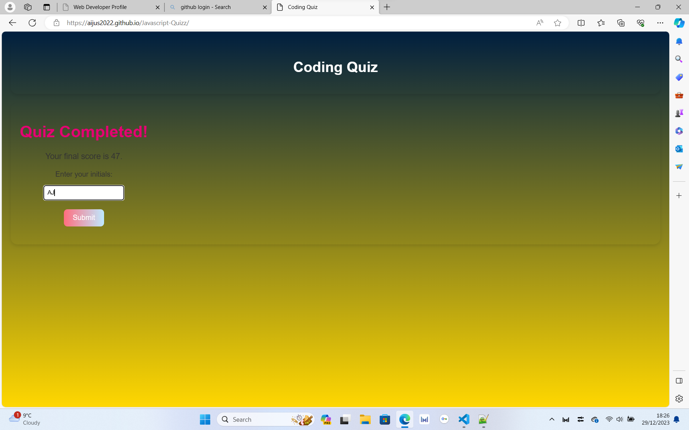

# Javascript-Quizz-App
Github Repository:https://github.com/Aijus2022/Javascript-Quizz-App
Deployed website:https://github.com/Aijus2022/Javascript-Quizz-App

## Table of Contents
- [Description](#description)
- [Features](#features)
- [Usage](#usage)
- [Installation](#installation)
- [How to Play](#how-to-play)
- [Screenshots](#screenshots)
- [Contributing](#contributing)
- [License](#license)

## Description
The Javascript-Quizz-App is a web-based quiz application that allows users to test their coding knowledge through a series of questions. The app is designed to be interactive, challenging, and educational. It features a responsive design and an intuitive user interface.

## Features
- Multiple-choice questions on Javascript concepts
- Timed quiz to add an element of challenge
- Score tracking and display at the end of the quiz
- User-friendly interface with smooth transitions

## Usage
To use the Javascript-Quizz-App, follow these steps:
1. Clone the repository to your local machine.
2. Open the `index.html` file in a web browser.
3. Click on "Start Quiz" to begin the coding challenge.

## Installation
No installation is required to use the Javascript-Quizz-App. Simply open the `index.html` file in a web browser.

## How to Play
1. Click on "Start Quiz" to initiate the quiz.
2. Answer each multiple-choice question within the given time.
3. For each correct answer, you'll earn points.
4. For each incorrect answer, a time penalty will be applied.
5. At the end of the quiz, enter your initials and click "Submit" to record your score.

## Screenshots

## Contributing
If you would like to contribute to the development of the Javascript Quiz App, please follow these steps:
1. Fork the repository:https://github.com/Aijus2022/Javascript-Quizz-App
2. Create a new branch for your feature (`git checkout -b feature/your-feature`).
3. Commit your changes (`git commit -m 'Add a new feature'`).
4. Push to the branch (`git push origin feature/your-feature`).
5. Open a pull request.

## License
This project is licensed under the [MIT License](LICENSE).

Feel free to contact the project maintainers if you have any questions or concerns.
